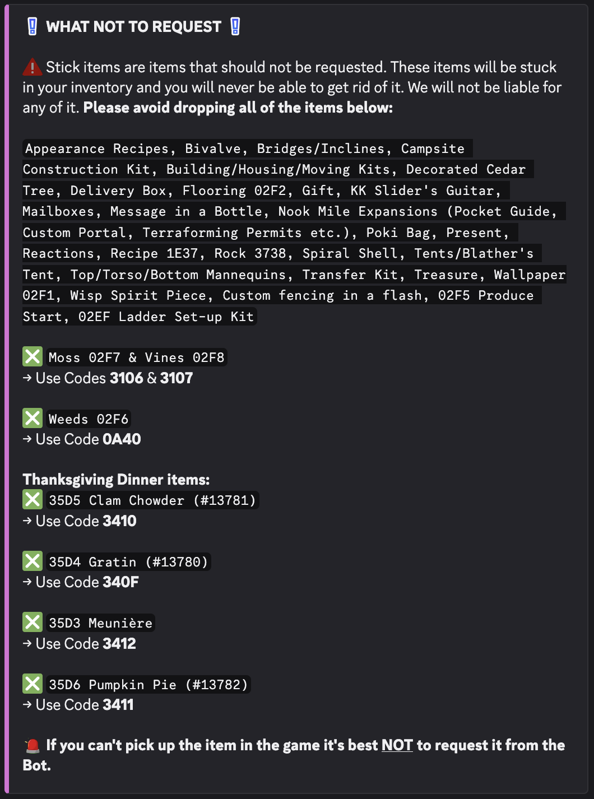
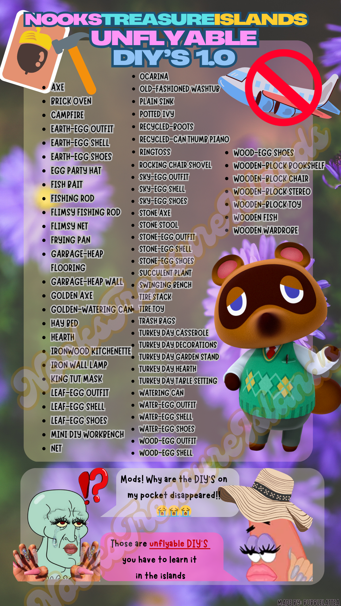
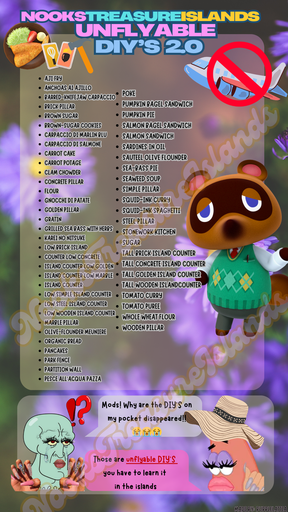

# Omega ToGo Bot Order Generator

This project takes the data from the [ACNH data spreadsheet](https://tinyurl.com/acnh-sheet) and collects the data related to items that you can use to spawn sets using the Omega ToGo Bots from NooksTreasureIslands discord. Access to those bots are not discussed here.

## Upcoming features

- [x] ~~Fix possibly problematic item codes or stick items.~~ Filtered the ones I could find out.
      
- [ ] Look into "Crafted Item Internal ID" vs "Internal ID"
- [ ] Saving orders
- [ ] Images but that might be a bit difficult to optimize.
- [ ] Auth? Maybe.

## Information and Notes

Data is collated from the spreadsheet and the internal IDs are converted into hex. Many items have variations and the Omega ToGo Bots use this pattern for handling this:

```
Patterns are hex
000 -> 0
032 -> 20
064 -> 40
096 -> 60
128 -> 80
160 -> A0
192 -> C0
224 -> E0

Variations are 0 thru 7 (could not find one with more but this is safe up to 9, i.e. an item with 10 variations is safe)

0 160 -> A0 + 0 = A0
000000 A0 0000 CODE

0 128 -> 80 + 1 = 80
000000 80 0000 CODE

1 0 -> 0 + 1 = 01
000000 01 0000 CODE

1 128 -> 80 + 1 = 81
000000 81 0000 CODE

1 160 -> A0 + 1 = A1
000000 A1 0000 CODE

070B 0 160
000000 A0 0000 070B

070B 1 160

000000 A1 0000 070B

Just do hex addition and pad it, if needed.
```

## DIY and Cooking Recipes (WIP)

There are a total of 924 recipes (783 DIY recipes and 141 cooking recipes), including those only obtainable via the Happy Home Paradise DLC. I'll be referring to both recipe types as just DIYs.

DIYs can be ordered from the bots but they do not follow the same pattern as items. That is why there are two search boxes for items and DIYs.

It should also be noted that the following DIY recipes are unflyable, meaning that you would need to learn the DIY recipe at the island.



